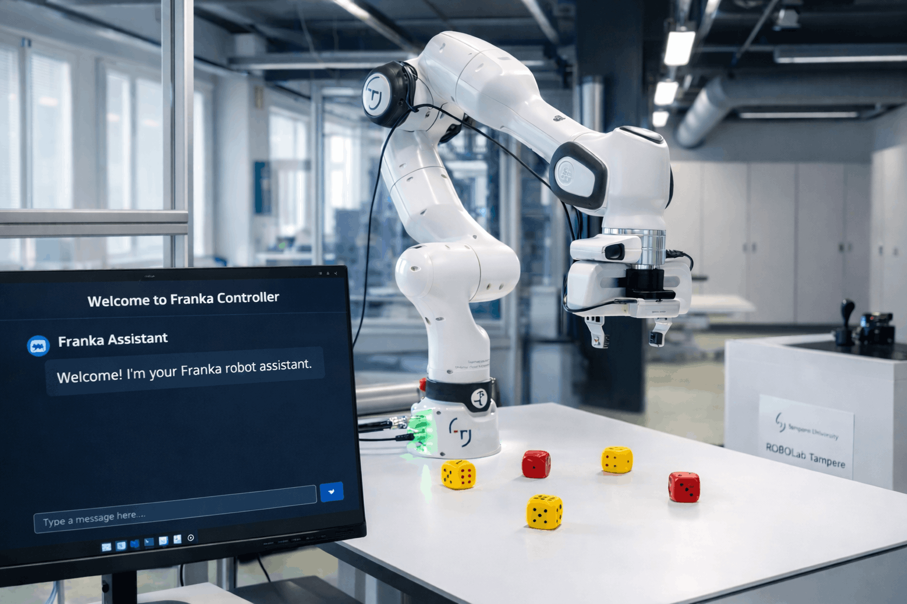
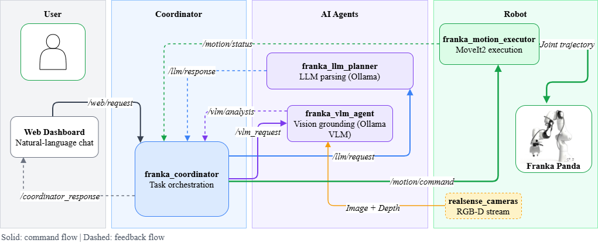
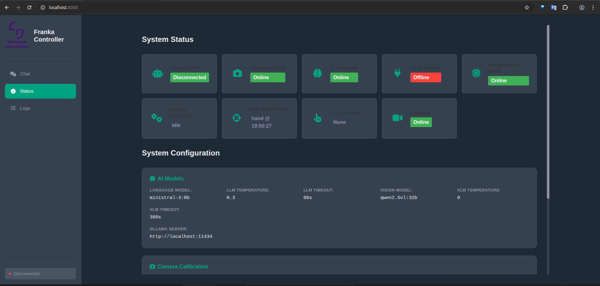
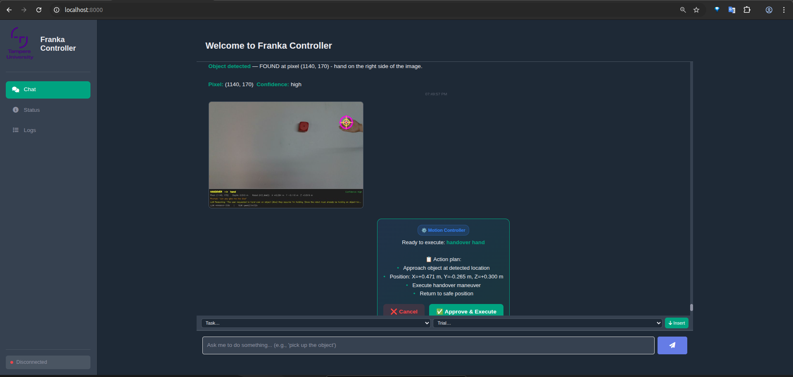

<div align="center">
# A Conversational framework for Human-Robot Collaborative Manipulation with Distributed AI models
</div>


<div align="center">




[Quick Start](#quick-start-1️⃣) • [Documentation](#documentation-5️⃣) • [Usage](#usage-examples) • [Packages](#packages-2️⃣)

</div>

---

## Overview

This system enables **natural language control** of a Franka FR3 robot arm for intelligent pick-and-place tasks using cutting-edge LLMs and VLMs. Users interact via an intuitive **web dashboard**, sending commands like *"pick up the blue cube"* and the system handles the rest—from vision understanding to motion execution.

| Component | Technology | Purpose |
|-----------|-----------|---------|
| **LLM** | Ministral 3 8B | Natural language understanding & command routing |
| **VLM** | Qwen2.5-VL 32B | Scene understanding & object grounding |
| **Motion** | MoveIt2 + ROS2 | Motion planning & collision avoidance |
| **Calibration** | ArUco Markers | Camera-to-robot coordinate transformation |
| **Interface** | Web Dashboard | Real-time monitoring & user confirmation |

---

## Key Features

| Feature | Description |
|---------|---|
| **Natural Language Commands** | Control robot via natural language |
| **Vision-Guided Manipulation** | VLM-based object detection & grounding |
| **Safety-First** | User confirmation workflow for all motions |
| **Multiple Task Types** | Pick, place, handover, custom sequences |
| **Modern Dashboard** | Real-time status, confirmations, image display |
| **Centralized Config** | Single `config.yaml` for all settings |
| **Debug Visualization** | Annotated images for monitoring & analysis |

---

## System Architecture



<details>
<summary><b>How It Works</b></summary>

```
1. User speaks command via dashboard
2. LLM understands intent & routes request
3. VLM detects objects in scene
4. Coordinator transforms 2D→3D coordinates
5. Dashboard shows confirmation with target
6. User approves motion
7. MoveIt2 plans collision-free path
8. Robot executes with velocity scaling
9. Real-time feedback to dashboard
```

</details>

---

## Results & Demonstrations

### Web Interface

<div align="center">

 


*Live monitoring and user confirmation interface*

</div>

### Evaluation & Performance

<div align="center">

**Object Detection Accuracy**

[Successful](figures/evaluation/successful-object-detection.pdf) | [Challenges](figures/evaluation/failed-object-detection.pdf)

</div>

**Task Success Rates**

| Task Type | Single | Overlapped | Multiple |
|-----------|--------|-----------|----------|
| **Pick** | [Results](figures/evaluation/pickup_single.pdf) | [Results](figures/evaluation/pickup_overlapped.pdf) | [Results](figures/evaluation/pickup_multiple.pdf) |
| **Place** | [Results](figures/evaluation/place_single.pdf) | [Results](figures/evaluation/place_overlapped.pdf) | [Results](figures/evaluation/place_multiple.pdf) |
| **Handover** | [Results](figures/evaluation/handover_single.pdf) | [Results](figures/evaluation/handover_overlapped.pdf) | [Results](figures/evaluation/handover_multiple.pdf) |

### Video Demonstrations

**Pick & Place with Franka FR3**  
Real-world execution of natural language commands with vision grounding.


**Scene Description & Understanding**  
VLM analyzing workspace and detecting multiple objects.


---

## Quick Start (1️⃣)

### Prerequisites

```
✓ Ubuntu 22.04 LTS      ✓ Python 3.10+         ✓ ROS2 Jazzy
✓ MoveIt2              ✓ Ollama               ✓ NVIDIA GPU (recommended)
```

### Installation

```bash
# Clone
git clone https://github.com/cogrob-tuni/franka-llm.git && cd franka-llm

# Setup Ollama & models
curl -fsSL https://ollama.com/install.sh | sh
ollama pull ministral-3:8b && ollama pull qwen2.5vl:32b

# Build ROS2 packages
colcon build --symlink-install && source install/setup.sh
```

### Configuration

All settings in `config.yaml`:

```yaml
llm:
  model: "ministral-3:8b"
  base_url: "http://localhost:11434"

vlm:
  model: "qwen2.5vl:32b"
  base_url: "http://localhost:11434"

robot:
  safe_height: 0.60       # Navigation height (m)
  grasp_height: 0.14      # Grasp height (m)
  handover_height: 0.30   # Handover height (m)
```

### Running

```bash
./start_system.sh    # Start all nodes
./stop_system.sh     # Stop all nodes
```

**Access**: http://localhost:8000

**Full guide**: [RUNNING.md](RUNNING.md)

---

## Usage Examples

<details>
<summary><b>Pick & Place</b></summary>

```
You:    "pick up the blue cube"
Robot:  [Detects object] ✓ [Shows confirmation]
You:    [Clicks Approve]
Robot:  [Grasps & lifts] ✓

You:    "place it on the table"
Robot:  [Plans path] ✓ [Executes placement]
```

</details>

<details>
<summary><b>Stacking</b></summary>

```
You:    "stack the small cube on top of the red block"
Robot:  [Calculates height] ✓ [Adjusts offset]
You:    [Confirms]
Robot:  [Places with precision offset]
```

</details>

<details>
<summary><b>Handover</b></summary>

```
You:    "hand me the tool"
Robot:  [Detects hand position] ✓ [Moves to height]
Robot:  [Opens gripper] ✓
```

</details>

<details>
<summary><b>Special Commands</b></summary>

```
You:    "go home" → [Safe reset position]
You:    "dance" → [7-position creative motion]
```

</details>

---

## Packages (2️⃣)

<table>
<tr>
<td width="15%">

### 1️⃣ franka_coordinator

</td>
<td>

**Central coordination & 3D transforms**

- Bridges all components
- VLM grounding & depth→3D conversion  
- ArUco calibration
- User confirmation flow

[Full docs](src/franka_coordinator/README.md)

</td>
</tr>

<tr>
<td>

### 2️⃣ franka_llm_planner

</td>
<td>

**Natural language understanding**

- Ministral 3 8B command parsing
- Intent routing to agents
- Response generation

[Full docs](src/franka_llm_planner/README.md)

</td>
</tr>

<tr>
<td>

### 3️⃣ franka_motion_executor

</td>
<td>

**Motion planning & execution**

- MoveIt2 integration
- Pick, place, handover, dance primitives
- Safety constraints

[Full docs](src/franka_motion_executor/README.md)

</td>
</tr>

<tr>
<td>

### 4️⃣ franka_vlm_agent

</td>
<td>

**Scene understanding**

- Qwen2.5-VL 32B object detection
- Visual grounding with bounding boxes
- Debug visualizations

[Full docs](src/franka_vlm_agent/README.md)

</td>
</tr>

<tr>
<td>

### 5️⃣ franka_vision_detection

</td>
<td>

**Legacy vision** *(deprecated)*

Being replaced by modern VLM agent

</td>
</tr>

<tr>
<td>

### 6️⃣ realsense_cameras

</td>
<td>

**RGB-D sensing**

Intel RealSense D435i integration

[Full docs](src/realsense_cameras/README.md)

</td>
</tr>
</table>

---

## Testing & Troubleshooting (3️⃣)

<details>
<summary><b>Common Issues & Fixes</b></summary>

| Issue | Root Cause | Solution |
|-------|-----------|----------|
| Web UI not loading | Server not started | `cd ui && python3 -m http.server 8000` |
| "Connection refused" Ollama | Service down | `ollama serve` then verify: `ollama list` |
| VLM slow (30+ sec) | CPU inference or low GPU mem | Use GPU: `nvidia-smi` or smaller model: `qwen2.5vl:7b` |
| Robot doesn't move | Missing controllers | See MoveIt section below |
| Confirmation dialog missing | Web handler out of sync | Restart web_handler after UI server |
| Incorrect 3D positions | Bad calibration | Verify ArUco: `ls ~/franka-llm/calibration/` |
| Camera "depth stream failure" | Hardware not reset | Unplug USB, wait 3s, replug: `./restart_node.sh camera` |

</details>

<details>
<summary><b>MoveIt Controller Issues (Common)</b></summary>

**Symptom**: `ros2 control list_controllers` shows "No controllers are currently loaded!"

**Root Cause**: Network-connected robot hardware (172.16.0.2) doesn't initialize fast enough

**Solution** (manual workaround):
```bash
# 1. Let MoveIt start (wait 15-20 seconds)
ros2 launch franka_llm_planner moveit.launch.py

# 2. In another terminal, manually load:
ros2 control load_controller joint_state_broadcaster --set-state active
ros2 control load_controller franka_robot_state_broadcaster --set-state active
ros2 control load_controller fr3_arm_controller --set-state active

# 3. Verify all active:
ros2 control list_controllers
# Expected: [active] for all three
```

</details>

<details>
<summary><b>Debug Tools</b></summary>

```bash
# System status
ros2 node list                    # All nodes
ros2 control list_controllers     # MoveIt status
ros2 topic list | grep motion     # Motion topics

# Monitor live data
ros2 topic echo /motion/status    # Motion updates
ros2 node info /coordinator_node  # Node details

# View debug outputs
ls ~/franka-llm/debug_images/
eog ~/franka-llm/debug_images/vlm_debug_*.jpg

# Restart individual nodes
./restart_node.sh motion          # Motion executor
./restart_node.sh moveit          # MoveIt
./restart_node.sh camera          # RealSense
./restart_node.sh ui              # Web UI
```

</details>

---

## Evaluation & Results (4️⃣)

<b>Benchmark Performance (180 trials)</B>

[Full CSV Results](robot_llm_vlm_experiments.csv)


---

## Documentation (5️⃣)

| Resource | Purpose |
|----------|---------|
| [Architecture](docs/architecture.md) | System design & component interactions |
| [Setup Guide](docs/setup.md) | Detailed installation instructions |
| [Metrics](docs/metrics.md) | Performance evaluation criteria |
| [System Log](docs/system_log.txt) | Experiment logs & timestamps |
| [Experiment Results](robot_llm_vlm_experiments.csv) | Benchmark data (180 trials) |
| [Running Guide](RUNNING.md) | Full operation manual |
| [VLM Setup](src/franka_vlm_agent/VLM_QUICKSTART.md) | Vision model configuration |

---

## Development & Contributing (6️⃣)

<details>
<summary><b>Development Workflow</b></summary>

### Branch Structure
```
main             ← Stable releases
  └─ dev         ← Active development
       └─ demo-* ← Demo snapshots
```

### Adding New Features

**1. New Command Type**
```python
# 1. Update LLM prompt (franka_llm_planner/llm_node.py)
# 2. Add motion handler (franka_motion_executor/motion_executor_node.py)
# 3. Test: ros2 service call /motion/execute ...
# 4. Add UI elements if needed
```

**2. New Placement Strategy**
```python
# Update: coordinator_node.py → handle_vlm_grounding()
# Update: LLM system prompt with examples
# Test with real objects
```

**3. Configuration-Only Changes**
```yaml
# Just update config.yaml - NO code changes needed
# Restart affected nodes to apply
```

</details>

<details>
<summary><b>Contributing Guidelines</b></summary>

### Steps
1. **Fork** the repository
2. **Create branch**: `git checkout -b feature/your-feature`
3. **Make changes** with tests
4. **Run**: `colcon test && colcon build`
5. **Submit PR** with clear description

### Questions?
- arash.ghasemzadehkakroudi@tuni.fi
- roel.pieters@tuni.fi
- [Open GitHub issue](https://github.com/cogrob-tuni/franka-llm/issues)

</details>

---

### Important Disclaimers

**This is a high-powered robotic system.** Users are responsible for safe operation. The authors and institution make no warranty and assume no liability for injuries or property damage resulting from operation of this system.

---

## License & Attribution

<div align="center">

**Licensed under Apache License 2.0**

[View full license](LICENSE)

© 2026 **Arash Ghasemzadeh Kakroudi** and **Roel Pieters**  
*Automation Technology and Mechanical Engineering*  
*Tampere University, Finland*

</div>

---

<div align="center">

### Ready to Get Started?

**[Quick Start](#quick-start)** | **[Documentation](docs/architecture.md)** | **[Report Issues](https://github.com/cogrob-tuni/franka-llm/issues)**

Made with ❤️ for robotics research

</div>
